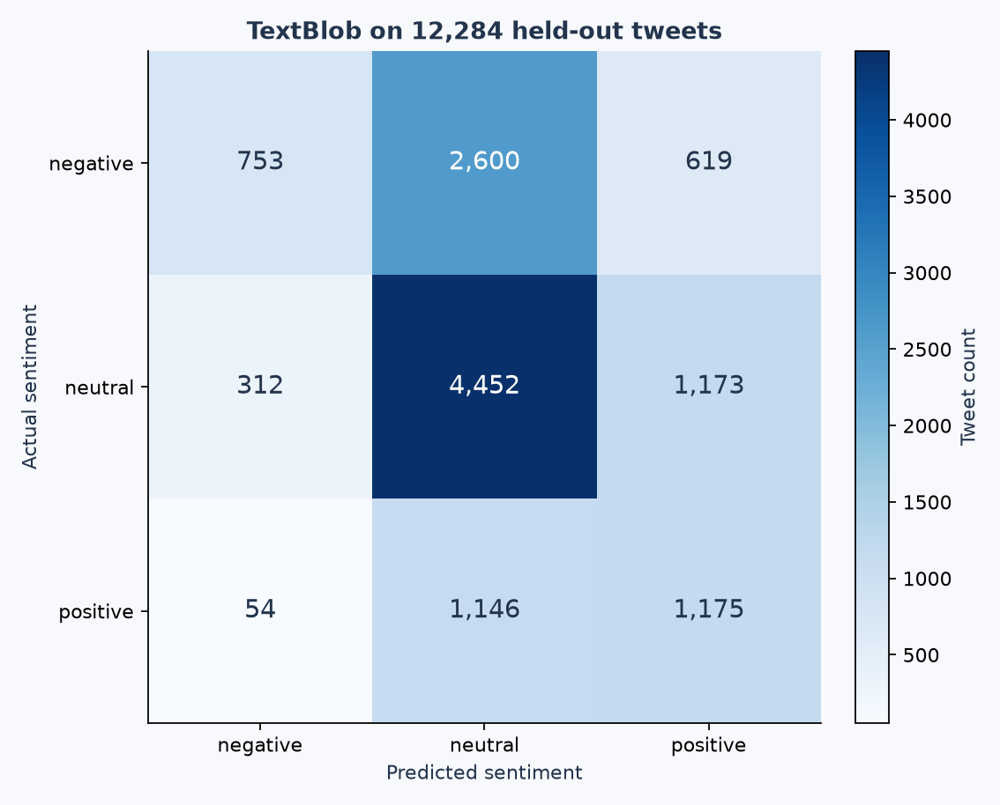

# Tweet Sentiment Analyzer

**Python · NLP · TextBlob | Labelled benchmark evaluation**

How far can a lightweight sentiment lexicon go on real tweet text? This project
cleans text, scores polarity with TextBlob's `PatternAnalyzer`, selects a neutral
band on validation data, and measures its performance on TweetEval's test split.

It classifies **negative, neutral and positive sentiment**, not discrete emotions.
TextBlob's lexicon is pre-existing; this project does not claim to train a new language model.



## Measured results

Threshold selection used **2,000 validation tweets**; final evaluation
used **12,284 test tweets**. The baseline class was selected from
**45,615 training labels**, and is `neutral`.

| Held-out metric | TextBlob | Training-majority baseline |
|---|---:|---:|
| Macro precision | 0.5373 | 0.1611 |
| Macro recall | 0.4781 | 0.3333 |
| Macro F1 | 0.4552 | 0.2172 |
| Accuracy | 0.5194 | 0.4833 |

Macro precision is the unweighted mean of three class precisions, with zero division
set to zero. It is **53.7%**, not 80%. Macro F1 gives each class equal weight and
shows a larger improvement over the majority baseline than accuracy does.
Macro recall is included for the TweetEval sentiment benchmark's average-recall metric;
macro F1 should not be compared directly with that leaderboard column.

## Method

1. Load the pinned TweetEval sentiment splits and verify hashes and label alignment.
2. Decode HTML entities; remove URLs and mentions; strip hashtag markers while
   retaining their words. Preserve negation, capitalisation and punctuation.
3. Compute polarity using `PatternAnalyzer` (range -1 to +1). No corpus download,
   API key, model training or access to a live social-media account is needed.
4. Search neutral-band thresholds `[0, .05, .10, .15, .20, .25, .30, .40, .50]`
   using validation macro F1 only; break ties toward the smaller threshold.
5. Select **±0.20**: scores inside or on the boundaries are neutral,
   lower scores negative, higher scores positive. Validation macro F1 is
   **0.4924**.
6. Freeze that rule, then evaluate on the original official test split.
   Preserve all rows, including 3 duplicate cleaned texts,
   for comparability with the supplied split. No test labels select the threshold.

## What the errors show

Negative recall is only **18.96%**: 2,600 of 3,972 negative tweets are labelled neutral
and 619 are labelled positive. The model misses much negative language even though
its negative-class precision is higher. Stronger precision on one class cannot be
reported as overall precision. See the per-class report in `metrics.json`.

A hand-authored example such as “Great, another delayed train.” illustrates why
positive words can mask negative intent. This is an explanatory example, not
benchmark evidence or an extra labelled test set. Sarcasm, implicit context, slang,
emojis, mixed sentiment and domain shift are known weaknesses to investigate.
Polarity is **not a confidence probability**; outputs should not be used to infer
someone's mental health or personal characteristics.

## Try your own text

```bash
python -m src.sentiment --text "I love this update!"
python -m src.sentiment --text "Great, another delayed train."
```

The command uses the committed validation-selected threshold. Re-run the benchmark
to regenerate that configuration and all measured results.

## Evidence

- [`metrics.json`](reports/metrics.json): all macro metrics, per-class support and baseline.
- [`threshold_search.csv`](reports/threshold_search.csv): every candidate's validation score.
- [`test_predictions.csv`](reports/test_predictions.csv): gold/predicted labels and polarity
  for each zero-based official test row; tweet text is not included.
- [`confusion_matrix.csv`](reports/confusion_matrix.csv): actual classes in rows, predictions in columns.
- [`sentiment_distribution.png`](reports/sentiment_distribution.png): class and prediction balance.

## Limitations and next investigation

This is an English lexicon baseline evaluated on an older benchmark. It does not
establish accuracy on current tweets, other languages or a specific customer domain.
The original split is trusted; near-duplicates across splits are not audited.
Threshold selection can overfit validation data. There is no uncertainty calibration.
Next, compare a TF-IDF/logistic-regression model trained on the training split and
chosen on validation; use a fresh evaluation set for iterative claims after inspecting
these test results. Keep this inexpensive TextBlob baseline for comparison.

## Data and attribution

Source: [Cardiff NLP TweetEval](https://github.com/cardiffnlp/tweeteval), sentiment task,
derived from SemEval-2017 Task 4. Labels are `0=negative`, `1=neutral`, `2=positive`.
Files are pinned by commit and hash in [`data/sources.json`](data/sources.json).
The repository notes that original task and Twitter source restrictions may apply.
Raw tweets are downloaded locally and excluded from Git and repository archives.

Cite Barbieri, Camacho-Collados, Espinosa-Anke and Neves (2020),
[*TweetEval: Unified Benchmark and Comparative Evaluation for Tweet Classification*](https://aclanthology.org/2020.findings-emnlp.148/),
and Rosenthal, Farra and Nakov (2017),
[*SemEval-2017 Task 4: Sentiment Analysis in Twitter*](https://aclanthology.org/S17-2088/).

## CV wording supported by this run

> Built a TextBlob sentiment pipeline and evaluated 12,284 labelled tweets;
> achieved macro F1 of 0.455 versus a 0.217 majority baseline, with validation-based
> threshold selection and per-class error analysis.

## Run it locally

Use **Python 3.12**. From this repository's root:

```bash
python -m venv .venv
```

Activate it in Windows PowerShell with `.venv\Scripts\Activate.ps1`,
or on macOS/Linux with `source .venv/bin/activate`.
If PowerShell blocks activation, use `.venv\Scripts\python.exe` in place of `python`.

```bash
python -m pip install -r requirements.txt
python -m src.sentiment
```

The first run downloads the public source files and checks their SHA-256 hashes.
Later runs use `data/raw/`. A changed source causes an explicit error rather than
silently changing the reported results. Delete a corrupted local cache file and retry;
if upstream bytes changed, review the data and update the manifest deliberately.

### Notebook and tests

```bash
python -m pip install -r requirements-dev.txt
python -m pytest -q
```

Open `notebooks/analysis.ipynb` in VS Code with the Jupyter extension and select
your `.venv` Python interpreter, or open it in an existing Jupyter installation.
The committed notebook contains executed outputs and can be viewed directly on GitHub.
It reruns the same pipeline, then explains its evidence. It works from the root or
the `notebooks` directory. No separate notebook-only implementation is maintained.

## Repository map

```text
src/                  Reusable analysis and command-line entry point
notebooks/            Executed, narrated walkthrough
data/sources.json     Exact source URLs, file sizes and SHA-256 hashes
reports/              Measured results, prediction tables and figures
tests/                Offline checks for data handling and metric integrity
.github/workflows/    Automated tests on push and pull request
requirements.txt      Exact versions of direct runtime dependencies
requirements-dev.txt  Runtime dependencies plus notebook and test tools
```

`reports/metrics.json` is the result of a real run, not a target or invented score.
`reports/run_metadata.json` records the execution time, Python and library versions,
and data provenance. Re-running updates generated reports. Direct dependencies are
pinned; transitive dependency resolution may differ on future installs.

## Scope and licensing

This is an educational portfolio project. Source code is provided under the MIT
license in `LICENSE`; that license does **not** relicense third-party datasets.
Raw source data are excluded from Git and from the downloadable repository archive.
